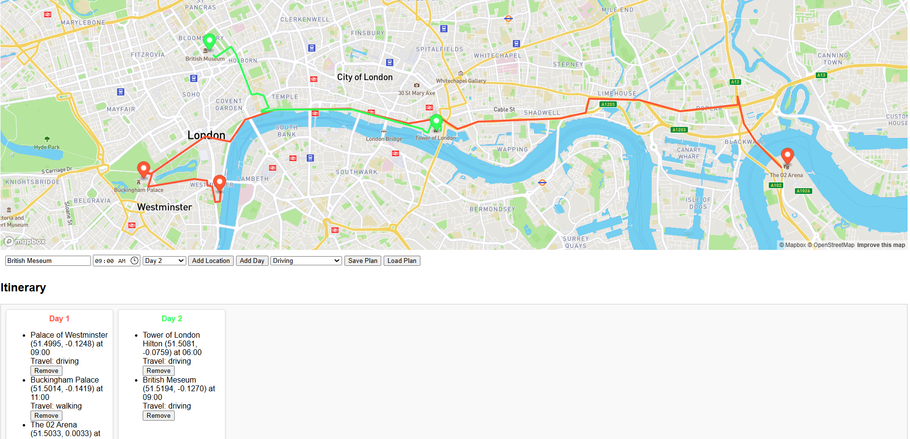

# Trip Planner

## Overview
The **Trip Planner** application is a dynamic web app designed to help users plan trips by organizing locations, days, and routes visually on an interactive map. The app integrates Mapbox for mapping and OpenAI for geocoding. It allows users to add locations, customize travel modes, and save/load plans.




## Features

1. **Interactive Map**:
   - Displays planned locations with markers.
   - Shows routes for each day's itinerary.
   - Uses Mapbox for visualization.

2. **Day Planning**:
   - Add multiple days to organize the trip.
   - Assign locations to specific days with times.
   - Customize travel mode for routes (driving, walking, cycling, etc.).

3. **Save and Load Plans**:
   - Save itineraries with a custom name.
   - Reload saved itineraries.

4. **Customizable Itinerary**:
   - Edit or remove locations.
   - Automatically sorts locations by time within each day.

5. **Geocoding with OpenAI**:
   - Converts location names into latitude and longitude dynamically.


## Project Structure

```
TRIP_PLANNER/
├── data/
│   ├── itinerary.json
│   ├── locations.json
├── node_modules/
├── pictures/
├── public/
│   ├── index.html
│   ├── script.js
│   ├── style.css
├── .env
├── .gitignore
├── package-lock.json
├── package.json
├── README.md
└── server.js
```

### Key Files

- **index.html**:
  - Contains the structure of the web interface, including controls for adding days, locations, and saving/loading plans.

- **script.js**:
  - Handles map initialization, itinerary management, geocoding, and route drawing.

- **style.css**:
  - Provides the styling for the application, including map dimensions and layout of the itinerary.

- **server.js**:
  - A Node.js server to manage saving/loading plans and fetching data from APIs.

- **.env**:
  - Stores sensitive keys for OpenAI and Mapbox securely.

---

## Installation and Setup

### Prerequisites
- Node.js installed on your machine.
- A Mapbox account and API key.
- OpenAI API key.

### Steps
1. Clone the repository:
   ```bash
   git clone https://github.com/quickdrew/TripPlanner.git
   ```

2. Navigate to the project directory:
   ```bash
   cd TRIP_PLANNER
   ```

3. Install dependencies:
   ```bash
   npm install
   ```

4. Configure environment variables:
   - Create a `.env` file in the root directory.
   - Add your API keys:
     ```
     OPENAI_API_KEY=your-openai-api-key
     MAPBOX_ACCESS_TOKEN=your-mapbox-access-token
     ```

5. Start the server:
   ```bash
   node server.js
   ```

6. Open the application in your browser:
   ```
   http://localhost:3000
   ```

---

## Usage

1. **Initialize Map**:
   - The map is centered at a default location. Start adding days and locations to plan your trip.

2. **Add Days and Locations**:
   - Use the controls to add days and assign locations to specific days.
   - Enter a location name and specify a time.

3. **Save and Load Plans**:
   - Save plans with a name for future use.
   - Reload previously saved plans to continue editing.

4. **Customize Routes**:
   - Choose travel modes for accurate routing.
   - Routes are color-coded by day.

---

## API Integration

### OpenAI
- **Purpose**: Geocoding (converts location names to latitude and longitude). The advantage of using ChatGPT lies in its ability to interpret abstract or imprecise location searches. However, there is a possibility of it returning incorrect locations due to the inherent ambiguity of some queries.
- **Endpoint**: `/get-lat-lng`

### Mapbox
- **Purpose**: Map rendering and route drawing.
- **Endpoints**:
  - Map rendering: `https://api.mapbox.com`.
  - Directions: `https://api.mapbox.com/directions/v5/mapbox/`

---

## Future Enhancements

1. **User Authentication**:
   - Enable users to save and load plans linked to their accounts.

2. **Enhanced Geocoding**:
   - Use a dedicated geocoding service for faster and more reliable results.

3. **Mobile Optimization**:
   - Improve layout and functionality for smaller screens.

4. **Sharing Options**:
   - Allow users to share their itineraries with others.

---
